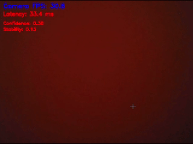
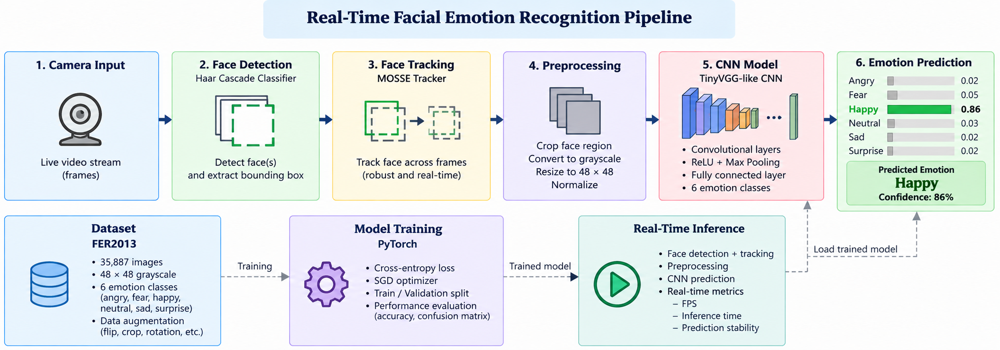

# Facial Emotion Recognition

Real-time facial emotion recognition system combining computer vision,
face tracking and deep learning for the classification of facial
expressions.

The system processes webcam images in real time and predicts one of
six emotion classes.


## Real-Time Demo

The system performs facial emotion recognition directly from a webcam,
with real-time prediction, confidence and stability monitoring.




## System Overview

The complete pipeline combines face detection, face tracking,
image preprocessing and CNN-based emotion classification.



The main processing stages are:

**Webcam → Face Detection → Face Tracking → Preprocessing → CNN → Emotion Prediction**

The real-time implementation uses:

- **Haar Cascade** for face detection
- **MOSSE Tracker** for face tracking
- Grayscale conversion and resizing to **48 × 48 pixels**
- A custom **TinyVGG-like CNN**
- Softmax-based confidence estimation
- Prediction stability monitoring
- Real-time FPS and latency measurements


## Objective

The objective of this project is to develop a lightweight facial emotion
recognition system capable of performing inference in real time.

The system is designed to combine:

- Facial expression classification
- Low-latency inference
- Real-time face tracking
- Confidence estimation
- Prediction stability monitoring


## Dataset

The model is trained and evaluated using the **FER2013** facial
expression dataset.

The project uses six emotion classes:

- Angry
- Fear
- Happy
- Neutral
- Sad
- Surprise

Example images from the dataset are available in:

```text
data/fer2013_examples.png
````
The original dataset is not included in this repository.

Dataset source:

- **Dataset:** FER2013
- **Source:** [Kaggle — FER2013](https://www.kaggle.com/datasets/msambare/fer2013)

More information about the dataset is available in:
````
data/README.md
````

## Model

The facial emotion classifier implemented in this repository is a
custom TinyVGG-like convolutional neural network implemented with
PyTorch.

The architecture contains:

- Two convolutional blocks
- Convolutional layers
- ReLU activations
- Max pooling
- A fully connected classification layer
- Six output classes


The model receives grayscale 48 × 48 facial images.

The model definition and training experiments are available in:
````
notebooks/Facial_recognition_Model_1_FER2013.ipynb
````
The model documentation is available in:
````
models/README.md
````

## Real-Time Inference

The real-time application is implemented in:
````
src/main_six_classes.py
````
The inference pipeline performs:

- Webcam frame acquisition
- Face detection using Haar Cascade
- Face tracking using MOSSE
- Face region extraction
- Grayscale conversion
- Resizing to 48 × 48
- CNN inference
- Softmax probability estimation
- Emotion prediction
- Confidence and stability estimation


The system also monitors:
````
Camera FPS
Pipeline FPS
Inference latency
Prediction confidence
Prediction stability
Project Structure
Facial-Emotion-Recognition/
│
├── README.md
├── LICENSE
├── requirements.txt
├── requirements-realtime.txt
│
├── notebooks/
│   └── Facial_recognition_Model_1_FER2013.ipynb
│
├── src/
│   └── main_six_classes.py
│
├── data/
│   ├── README.md
│   └── fer2013_examples.png
│
├── models/
│   └── README.md
│
└── results/
    ├── README.md
    ├── realtime_demo.gif
    └── pipeline.png
````
## Installation

Clone the repository:
````
git clone https://github.com/YOUR_USERNAME/Facial-Emotion-Recognition.git
cd Facial-Emotion-Recognition
````
Install the dependencies required for the training notebook:
````
pip install -r requirements.txt
````
For real-time inference only:
````
pip install -r requirements-realtime.txt
````
## Running the Real-Time Application

Before running the application, make sure that the trained model weights
are available locally.

The trained weights are not included in this repository.

In:
````
src/main_six_classes.py
````
specify the local path to the trained weights:
````
MODEL_PATH = "path/to/fer_weights_v5.pth"

model.load_state_dict(
    torch.load(MODEL_PATH, map_location=device)
)
````
Then run:
````
python src/main_six_classes.py
````
Press Q to close the application.

## Training

The complete training and evaluation workflow is provided in:
````
notebooks/Facial_recognition_Model_1_FER2013.ipynb
````
The notebook contains:

- Dataset loading
- Data preprocessing
- Data augmentation
- Model definition
- Training
- Validation
- Evaluation
- Visualization of results

The FER2013 dataset is downloaded programmatically using kagglehub.

## Results

The results/ directory contains selected results and visualizations
from the experiments.

These may include:

- Training and validation curves
- Confusion matrices
- Classification metrics
- Real-time performance measurements
- Real-time demonstration
  
See:
````
results/README.md
````
for more information.

## Technologies

The project uses:

- Python
- PyTorch
- Torchvision
- OpenCV
- NumPy
- Matplotlib
- FER2013
- Haar Cascade
- MOSSE Tracker

## Publication

This project is associated with the following publication:
````
H. Graïn, Y. Hayani, Y. Blot-El Mazouzi, A. Diallo, H. Bayd,
I. Sekkiou, and B. Magnier,
"Efficient Real-Time Facial Emotion Recognition via Optimized ResNet18
Feature Extraction,"
11th International Conference on Frontiers of Signal Processing
(ICFSP), 2026.

DOI:

10.1109/ICFSP70244.2026.11665376

IEEE Xplore

The publication is also listed by EuroMov Digital Health in Motion and
HAL.
````
## Authors

- Hamza Graïn
- Youssef Hayani
- Yanis Blot-El Mazouzi
- Amadou Diallo
- Hamza Bayd
- Imene Sekkiou
- Baptiste Magnier

This project was developed as a collaborative academic project.

## Citation

If you use this repository or refer to this work, please cite:
````
@inproceedings{grain2026emotion,
  author    = {
    Graïn, Hamza and
    Hayani, Youssef and
    Blot-El Mazouzi, Yanis and
    Diallo, Amadou and
    Bayd, Hamza and
    Sekkiou, Imene and
    Magnier, Baptiste
  },
  title     = {Efficient Real-Time Facial Emotion Recognition via
               Optimized ResNet18 Feature Extraction},
  booktitle = {11th International Conference on Frontiers of Signal
               Processing (ICFSP)},
  year      = {2026},
  doi       = {10.1109/ICFSP70244.2026.11665376}
}
````

## Data and Model Weights

The original FER2013 dataset is not distributed with this repository.

Trained model weights are also not distributed with this repository.

Users should obtain the dataset from its original source and provide
their own trained weights when running the real-time application.

Please refer to the original dataset source for the applicable terms
of use and licensing conditions.
